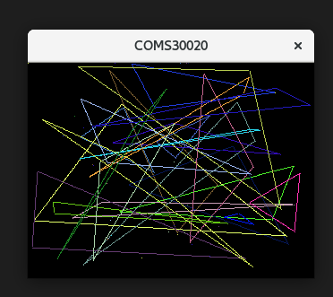
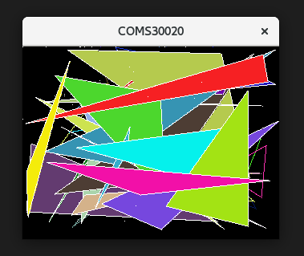
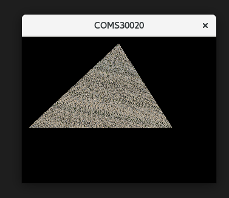
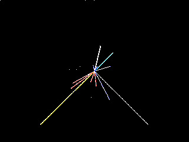

# Computer Graphics lab

### Week1 ###
*Done*

### Week2 ###
*Done*

### Week3 ###
*Task3*

*Task4*

*Task6*

### Week4 ###
*Failed from the Task6: the pointcloud render cannot be imagined of the room corners and boxes*

